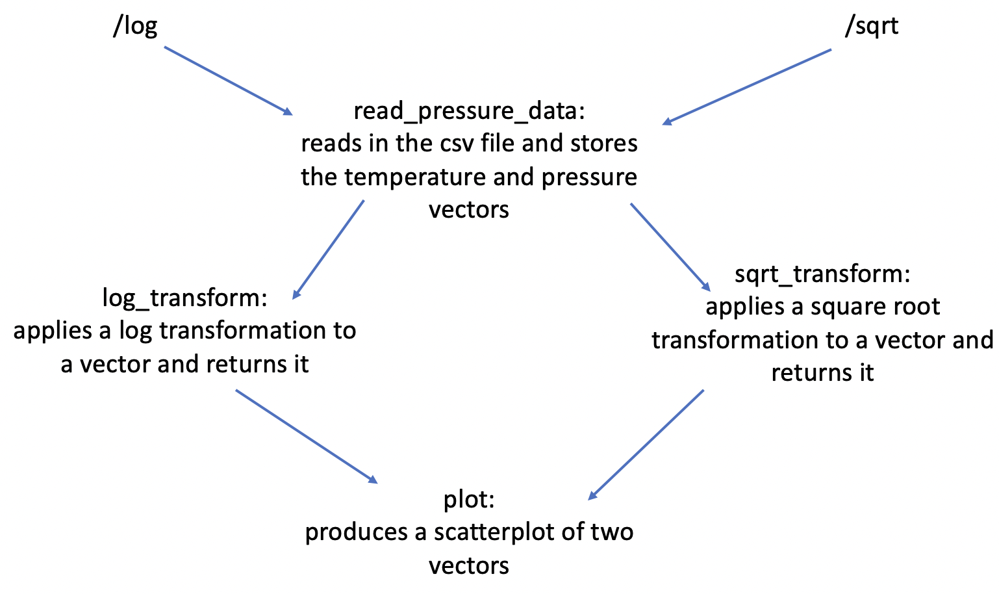
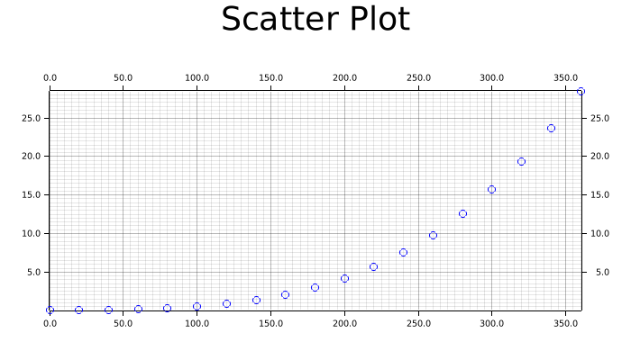

# Project 2 - Rust Microservice

The goal for this project will be to show how data transformations can be used to find relationships between variables. The first iteration of this project has functions to read in the data, apply log and square root transforms, and plot the data. The next step is to add the actix framework for the microservice. 
   
For the second iteration of the project, I added the actix mechanisms to interact with the microservice on the web page. The base page gives a welcome message, the log page computes the log transform and creates a plot, the sqrt page computes the square root transform and creates a plot, and the image page displays the plot.

For the final iteration, I moved the images to the page with the transformation. As a result, the /log page shows the graph for the log transform and the /sqrt page shows the graph for the square root transform:

Benchmarking: The /log page on average takes 0.87 seconds to run, and the /sqrt page takes on average 0.92 seconds to run.

## Running the Microservice
1. To run locally, users can just run `cargo run`

2. To run on minikube, I first created a docker image and pushed it to DockerHub by running the following commands:
        - `docker build -t microservice`
        - `docker build -t aliir/microservice`
        - `docker push aliir/microservice`
    The image is stored on [`aliir/microservice`](https://hub.docker.com/repository/docker/aliir/microservice)

    Then to run on minikube, I used the following commands:
        - `minikube start`
        - `kubectl create deployment microservice image=registry.hub.docker.com/aliir/microservice`
        - `kubectl get deployments`
        - `kubectl expose deployment microservice --type=LoadBalancer --port=8080`
        - `minikube service microservice --url`
        - `curl http://192.168.49.2:32377`
        
    To stop running and remove extra storage:
        - `kubectl delete service microservice`
        - `kubectl delete deployment microservice`
        - `minikube stop`

## References

* [rust-cli-template](https://github.com/kbknapp/rust-cli-template)
